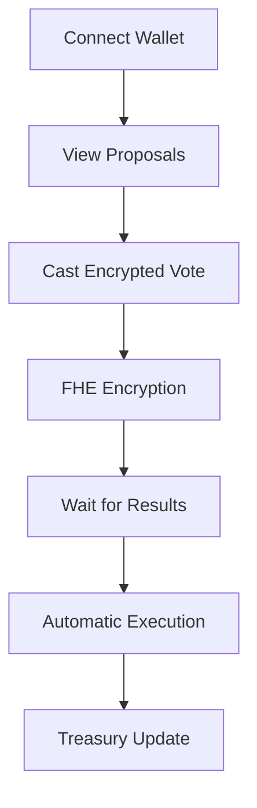

# ⚡ Cipher DAO Spend

> **Revolutionary DAO Governance with Zero-Knowledge Privacy** 🏛️

Experience the next generation of decentralized governance where your voting choices remain completely private until results are revealed. Built with cutting-edge FHE encryption technology.

## 🌟 Why Cipher DAO Spend?

### 🔐 Privacy-First Governance
- **Zero-Knowledge Voting**: Your votes are encrypted until results are revealed
- **FHE Encryption**: Fully Homomorphic Encryption protects all sensitive data
- **Anonymous Participation**: Vote without revealing your choices
- **Transparent Results**: Public verification of encrypted outcomes

### ⚡ Lightning-Fast Performance
- **Instant Transactions**: Sub-second voting and proposal execution
- **Gas Optimized**: Efficient smart contracts reduce transaction costs
- **Scalable Architecture**: Handle thousands of concurrent voters
- **Real-time Updates**: Live proposal status and voting progress

### 🏛️ Complete DAO Management
- **Proposal Creation**: Detailed spending proposals with categories
- **Treasury Management**: Secure fund allocation and tracking
- **Member Management**: Role-based access and reputation system
- **Voting Power**: Weighted voting based on contribution and reputation

## 🛠️ Technology Stack

| Component | Technology | Purpose |
|-----------|------------|---------|
| **Frontend** | React 18 + TypeScript + Vite | Modern, fast UI development |
| **Styling** | Tailwind CSS + shadcn/ui | Beautiful, responsive design |
| **Blockchain** | Ethereum Sepolia Testnet | Decentralized infrastructure |
| **Wallets** | RainbowKit + Wagmi + Viem | Multi-wallet support |
| **Encryption** | FHE via Zama Protocol | Privacy-preserving computation |
| **Smart Contracts** | Solidity with FHE Support | On-chain governance logic |

## 🚀 Quick Start

### Prerequisites
- Node.js 18+ 
- npm or yarn
- Git
- MetaMask or compatible wallet

### Installation
```bash
# Clone the repository
git clone https://github.com/Eva-Rodriguez-Bug/cipher-dao-spend.git
cd cipher-dao-spend

# Install dependencies
npm install

# Start development server
npm run dev
```

### Environment Setup
Create `.env.local`:
```env
NEXT_PUBLIC_CHAIN_ID=11155111
NEXT_PUBLIC_RPC_URL=your_sepolia_rpc_url
NEXT_PUBLIC_WALLET_CONNECT_PROJECT_ID=your_walletconnect_project_id
NEXT_PUBLIC_INFURA_API_KEY=your_infura_api_key
```

## 🎯 How It Works



### Governance Flow
1. **🔗 Connect**: Link your crypto wallet securely
2. **📋 Propose**: Create detailed spending proposals
3. **🗳️ Vote**: Cast encrypted votes on proposals
4. **⏳ Wait**: Results revealed after voting period
5. **💰 Execute**: Automatic fund allocation to approved proposals

## 📁 Project Structure

```
cipher-dao-spend/
├── 🎨 src/
│   ├── components/     # React components
│   │   ├── ui/        # Reusable UI components
│   │   ├── Header.tsx # Main header component
│   │   └── WalletConnection.tsx # Wallet integration
│   ├── pages/         # Route pages
│   │   └── Index.tsx  # Main DAO dashboard
│   ├── lib/           # Utilities & configurations
│   │   ├── wallet.ts  # Wallet configuration
│   │   └── utils.ts   # Helper functions
│   └── hooks/         # Custom React hooks
├── 📜 contracts/
│   └── CipherDaoSpend.sol  # FHE smart contract
├── 🎨 public/
│   └── favicon.svg    # Custom lightning icon
└── 📚 docs/           # Documentation
```

## 🏛️ DAO Features

### 📊 Proposal Management
- **Create Proposals**: Detailed spending requests with categories
- **Voting Periods**: Configurable voting windows
- **Execution Delays**: Security delays before fund allocation
- **Status Tracking**: Real-time proposal status updates

### 💰 Treasury Management
- **Fund Tracking**: Monitor available and locked funds
- **Transaction History**: Complete spending audit trail
- **Multi-signature**: Enhanced security for large transactions
- **Budget Allocation**: Category-based spending limits

### 👥 Member Management
- **Role Assignment**: Core Developer, Community Manager, etc.
- **Voting Power**: Reputation-based voting weights
- **Activity Tracking**: Member participation metrics
- **Reputation System**: Contribution-based reputation scores

### 🗳️ Voting System
- **FHE Encrypted**: Votes remain private until results
- **Weighted Voting**: Power based on reputation and contribution
- **Quorum Requirements**: Minimum participation thresholds
- **Automatic Execution**: Smart contract-based fund allocation

## 🚀 Deployment

### Vercel (Recommended)
1. Fork this repository
2. Connect to Vercel
3. Set environment variables
4. Deploy! 🎉

### Manual Build
```bash
npm run build
npm run preview
```

## 🎮 Available Scripts

| Command | Description |
|---------|-------------|
| `npm run dev` | Start development server |
| `npm run build` | Build for production |
| `npm run preview` | Preview production build |
| `npm run lint` | Run ESLint checks |

## 🔒 Security Features

### Privacy Protection
- **FHE Encryption**: All sensitive data encrypted on-chain
- **Zero-Knowledge Proofs**: Verify without revealing data
- **Private Voting**: Vote choices remain hidden
- **Secure Execution**: Tamper-proof proposal execution

### Smart Contract Security
- **Access Controls**: Role-based permissions
- **Time Locks**: Execution delays for security
- **Multi-signature**: Enhanced transaction security
- **Audit Ready**: Clean, documented code

## 🤝 Contributing

We welcome contributions! Here's how:

1. 🍴 Fork the repository
2. 🌿 Create a feature branch
3. ✨ Make your changes
4. 🧪 Test thoroughly
5. 📤 Submit a pull request

### Development Guidelines
- Follow TypeScript best practices
- Write comprehensive tests
- Update documentation
- Follow commit message conventions

## 📄 License

This project is licensed under the MIT License - see the [LICENSE](LICENSE) file for details.

## 🆘 Support

- 🐛 **Bug Reports**: [Open an issue](https://github.com/Eva-Rodriguez-Bug/cipher-dao-spend/issues)
- 💡 **Feature Requests**: [Start a discussion](https://github.com/Eva-Rodriguez-Bug/cipher-dao-spend/discussions)
- 📧 **Contact**: [GitHub Issues](https://github.com/Eva-Rodriguez-Bug/cipher-dao-spend/issues)

## 🌟 Roadmap

### Phase 1: Core Governance ✅
- [x] Proposal creation and voting
- [x] Treasury management
- [x] Member management
- [x] FHE encryption

### Phase 2: Advanced Features 🚧
- [ ] Multi-signature treasury
- [ ] Delegation system
- [ ] Advanced analytics
- [ ] Mobile app

### Phase 3: Ecosystem Integration 🔮
- [ ] Cross-chain support
- [ ] NFT governance tokens
- [ ] Integration with other DAOs
- [ ] Advanced privacy features

---

<div align="center">

**⚡ Built with ❤️ for the future of private DAO governance ⚡**

[](https://github.com/Eva-Rodriguez-Bug/cipher-dao-spend)
[](https://opensource.org/licenses/MIT)
[](https://www.typescriptlang.org/)
[](https://reactjs.org/)

</div>