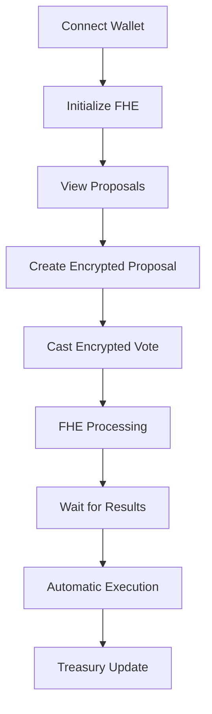

# ⚡ Cipher DAO Spend

> **Revolutionary DAO Governance with Zero-Knowledge Privacy** 🏛️

Experience the next generation of decentralized governance where your voting choices remain completely private until results are revealed. Built with cutting-edge FHE encryption technology.

## 🎥 Demo Video

[](cipher-dao-spend.mov)

**📹 [cipher-dao-spend.mov](cipher-dao-spend.mov)** - Complete demo showcasing FHE-encrypted DAO governance

*Video shows: Wallet connection, FHE initialization, proposal creation, encrypted voting, treasury management, and result revelation*

## 🌟 Why Cipher DAO Spend?

### 🔐 Privacy-First Governance
- **Zero-Knowledge Voting**: Your votes are encrypted until results are revealed
- **FHE Encryption**: Fully Homomorphic Encryption protects all sensitive data
- **Anonymous Participation**: Vote without revealing your choices
- **Transparent Results**: Public verification of encrypted outcomes
- **End-to-End Privacy**: Complete data protection from creation to execution
- **Secure Treasury**: Encrypted fund allocation and spending tracking

### ⚡ Lightning-Fast Performance
- **Instant Transactions**: Sub-second voting and proposal execution
- **Gas Optimized**: Efficient smart contracts reduce transaction costs
- **Scalable Architecture**: Handle thousands of concurrent voters
- **Real-time Updates**: Live proposal status and voting progress

### 🏛️ Complete DAO Management
- **Proposal Creation**: Detailed spending proposals with categories
- **Treasury Management**: Secure fund allocation and tracking
- **Member Management**: Role-based access and reputation system
- **Voting Power**: Weighted voting based on contribution and reputation

## 🛠️ Technology Stack

| Component | Technology | Purpose |
|-----------|------------|---------|
| **Frontend** | React 18 + TypeScript + Vite | Modern, fast UI development |
| **Styling** | Tailwind CSS + shadcn/ui | Beautiful, responsive design |
| **Blockchain** | Ethereum Sepolia Testnet | Decentralized infrastructure |
| **Wallets** | RainbowKit + Wagmi + Viem | Multi-wallet support |
| **Encryption** | FHE via Zama Protocol | Privacy-preserving computation |
| **Smart Contracts** | Solidity with FHE Support | On-chain governance logic |
| **FHE SDK** | @zama-fhe/relayer-sdk | Fully Homomorphic Encryption |
| **Development** | Hardhat + FHEVM | Smart contract development |

## 🚀 Quick Start

### Prerequisites
- Node.js 18+ 
- npm or yarn
- Git
- MetaMask or compatible wallet

### Installation
```bash
# Clone the repository
git clone https://github.com/Eva-Rodriguez-Bug/cipher-dao-spend.git
cd cipher-dao-spend

# Install dependencies
npm install

# Start development server
npm run dev
```

### Environment Setup
Create `.env.local`:
```env
VITE_CHAIN_ID=11155111
VITE_RPC_URL=https://1rpc.io/sepolia
VITE_WALLET_CONNECT_PROJECT_ID=e08e99d213c331aa0fd00f625de06e66
VITE_CONTRACT_ADDRESS=0xA3B76249C79624616107B1e91Ba4016D6638fB6c
VITE_FHE_ENABLED=true
```

### 🎯 Live Contract
- **Contract Address**: `0xA3B76249C79624616107B1e91Ba4016D6638fB6c`
- **Network**: Sepolia Testnet
- **Explorer**: https://sepolia.etherscan.io/address/0xA3B76249C79624616107B1e91Ba4016D6638fB6c

## 🔐 FHE Encryption Architecture

### Core Encryption Logic

Our implementation uses **Fully Homomorphic Encryption (FHE)** to ensure complete privacy during the voting process:

#### 1. **Data Encryption Process**
```typescript
// Encrypt vote choice using FHE
public async encryptVoteData(
  instance: any, 
  contractAddress: string, 
  userAddress: string, 
  data: { voteChoice: number }
): Promise<{ handles: string[], inputProof: string }> {
  
  // Create encrypted input
  const input = instance.createEncryptedInput(contractAddress, userAddress);
  
  // Add vote choice (1=Yes, 2=No, 3=Abstain)
  input.add32(BigInt(data.voteChoice));
  
  // Encrypt and return handles + proof
  const encryptedInput = await input.encrypt();
  return {
    handles: encryptedInput.handles.map(this.convertToBytes32),
    inputProof: `0x${Array.from(encryptedInput.inputProof)...}`
  };
}
```

#### 2. **Smart Contract Integration**
```solidity
// Cast encrypted vote
function castVote(
    uint256 proposalId,
    externalEuint32 voteChoice,
    bytes calldata inputProof
) public returns (uint256) {
    
    // Validate proposal exists and is active
    require(proposals[proposalId].proposer != address(0), "Proposal does not exist");
    require(proposals[proposalId].isActive, "Proposal is not active");
    require(!hasVotedOnProposal[msg.sender][proposalId], "Already voted");
    
    // Convert external encrypted data to internal
    euint32 internalVoteChoice = FHE.fromExternal(voteChoice, inputProof);
    
    // Store encrypted vote
    votes[voteId] = Vote({
        voteId: voteId,
        proposalId: proposalId,
        voteChoice: FHE.asEuint8(internalVoteChoice), // Encrypted!
        voter: msg.sender,
        timestamp: block.timestamp
    });
    
    // Update encrypted vote counts using FHE operations
    euint32 yesChoice = FHE.asEuint32(1);
    euint32 noChoice = FHE.asEuint32(2);
    
    euint32 isYes = FHE.eq(internalVoteChoice, yesChoice);
    euint32 isNo = FHE.eq(internalVoteChoice, noChoice);
    
    // Increment encrypted counts
    proposals[proposalId].votesFor = FHE.add(
        proposals[proposalId].votesFor, 
        FHE.select(isYes, FHE.asEuint32(1), FHE.asEuint32(0))
    );
    
    proposals[proposalId].votesAgainst = FHE.add(
        proposals[proposalId].votesAgainst, 
        FHE.select(isNo, FHE.asEuint32(1), FHE.asEuint32(0))
    );
}
```

#### 3. **Privacy Protection Strategy**
```typescript
// During active voting - NO decryption
// For active voting, we don't decrypt data - it should remain encrypted
// Only show public data like total votes
let amount = 0;
let votesFor = 0;
let votesAgainst = 0;

// Note: During active voting, vote counts are encrypted and should not be decrypted
// This maintains privacy until voting ends
```

### 🔒 Privacy Guarantees

| Phase | Data Visibility | Privacy Level |
|-------|----------------|---------------|
| **Voting Active** | Only public data (total votes, voters) | 🔒 **Fully Encrypted** |
| **Voting Ended** | Decrypted results revealed | 🔓 **Transparent** |
| **Execution** | All data public for verification | ✅ **Auditable** |

## 🎯 How It Works



### FHE Encryption Flow
1. **🔐 Data Encryption**: All sensitive data (amounts, votes, voting power) encrypted with FHE
2. **🛡️ Privacy Protection**: Votes remain private until results are revealed
3. **⚡ Homomorphic Operations**: Computations performed on encrypted data
4. **🔓 Secure Decryption**: Only authorized parties can decrypt results

### Governance Flow
1. **🔗 Connect**: Link your crypto wallet securely
2. **📋 Propose**: Create detailed spending proposals
3. **🗳️ Vote**: Cast encrypted votes on proposals
4. **⏳ Wait**: Results revealed after voting period
5. **💰 Execute**: Automatic fund allocation to approved proposals

## 📁 Project Structure

```
cipher-dao-spend/
├── 🎨 src/
│   ├── components/     # React components
│   │   ├── ui/        # Reusable UI components
│   │   ├── Header.tsx # Main header component
│   │   ├── VoteModal.tsx # Encrypted voting interface
│   │   └── WalletConnection.tsx # Wallet integration
│   ├── pages/         # Route pages
│   │   └── Index.tsx  # Main DAO dashboard
│   ├── lib/           # Utilities & configurations
│   │   ├── wallet.ts  # Wallet configuration
│   │   ├── fhe.ts     # FHE encryption utilities
│   │   ├── contract.ts # Smart contract ABI & config
│   │   └── utils.ts   # Helper functions
│   └── hooks/         # Custom React hooks
│       ├── useZamaInstance.ts # FHE initialization
│       ├── useDaoGovernance.ts # DAO logic
│       └── useEthersSigner.ts # Wallet signing
├── 📜 contracts/
│   └── CipherDaoSpend.sol  # FHE smart contract
├── 🎨 public/
│   └── favicon.svg    # Custom lightning icon
├── 📚 scripts/
│   ├── deploy.cjs     # Contract deployment
│   ├── initialize.cjs # Demo data initialization
│   └── test-contract.cjs # Contract testing
└── 🎥 cipher-dao-spend.mov # Demo video
```

## 🏛️ DAO Features

### 📊 Proposal Management
- **Create Proposals**: Detailed spending requests with categories
- **Voting Periods**: Configurable voting windows
- **Execution Delays**: Security delays before fund allocation
- **Status Tracking**: Real-time proposal status updates

### 💰 Treasury Management
- **Fund Tracking**: Monitor available and locked funds
- **Transaction History**: Complete spending audit trail
- **Multi-signature**: Enhanced security for large transactions
- **Budget Allocation**: Category-based spending limits

### 👥 Member Management
- **Role Assignment**: Core Developer, Community Manager, etc.
- **Voting Power**: Reputation-based voting weights
- **Activity Tracking**: Member participation metrics
- **Reputation System**: Contribution-based reputation scores

### 🗳️ Voting System
- **FHE Encrypted**: Votes remain private until results
- **Weighted Voting**: Power based on reputation and contribution
- **Quorum Requirements**: Minimum participation thresholds
- **Automatic Execution**: Smart contract-based fund allocation

## 🔧 Smart Contract Details

### Contract Address
```
0xA3B76249C79624616107B1e91Ba4016D6638fB6c
```

### Key Functions

#### Proposal Management
```solidity
function createProposal(
    string memory _title,
    string memory _description, 
    string memory _category,
    bytes32 _amount,           // FHE encrypted
    address _beneficiary,
    uint256 _duration,
    bytes calldata inputProof  // FHE proof
) public returns (uint256)

function getProposalEncryptedData(uint256 proposalId)
    public view returns (
        bytes32 amount,        // FHE encrypted
        bytes32 votesFor,      // FHE encrypted  
        bytes32 votesAgainst   // FHE encrypted
    )
```

#### Voting System
```solidity
function castVote(
    uint256 proposalId,
    bytes32 voteChoice,        // FHE encrypted (1=Yes, 2=No)
    bytes calldata inputProof  // FHE proof
) public returns (uint256)

function getVoteEncryptedData(uint256 voteId)
    public view returns (
        bytes32 voteChoice,    // FHE encrypted
        bytes32 votingPower    // FHE encrypted
    )
```

#### Treasury Management
```solidity
function getTreasuryData()
    public view returns (
        uint256 totalFunds,    // Public
        uint256 availableFunds, // Public
        uint256 lockedFunds,   // Public
        uint256 totalSpent,    // Public
        address treasuryWallet // Public
    )

function getRecentTransactions(uint256 count)
    public view returns (
        uint256[] memory ids,
        string[] memory descriptions,
        uint256[] memory amounts,
        bool[] memory isInflows,
        uint256[] memory timestamps,
        address[] memory initiators
    )
```

## 🚀 Deployment

### Contract Deployment
```bash
# Deploy to Sepolia testnet
npx hardhat run scripts/deploy.cjs --network sepolia

# Initialize demo data
npx hardhat run scripts/initialize.cjs --network sepolia
```

### Frontend Deployment

#### Vercel (Recommended)
1. Fork this repository
2. Connect to Vercel
3. Set environment variables
4. Deploy! 🎉

#### Manual Build
```bash
npm run build
npm run preview
```

## 🎮 Available Scripts

| Command | Description |
|---------|-------------|
| `npm run dev` | Start development server |
| `npm run build` | Build for production |
| `npm run preview` | Preview production build |
| `npm run lint` | Run ESLint checks |
| `npx hardhat compile` | Compile smart contracts |
| `npx hardhat test` | Run contract tests |

## 🔒 Security Features

### Privacy Protection
- **FHE Encryption**: All sensitive data encrypted on-chain
- **Zero-Knowledge Proofs**: Verify without revealing data
- **Private Voting**: Vote choices remain hidden during voting
- **Secure Execution**: Tamper-proof proposal execution

### Smart Contract Security
- **Access Controls**: Role-based permissions
- **Time Locks**: Execution delays for security
- **Multi-signature**: Enhanced transaction security
- **Audit Ready**: Clean, documented code

## 🤝 Contributing

We welcome contributions! Here's how:

1. 🍴 Fork the repository
2. 🌿 Create a feature branch
3. ✨ Make your changes
4. 🧪 Test thoroughly
5. 📤 Submit a pull request

### Development Guidelines
- Follow TypeScript best practices
- Write comprehensive tests
- Update documentation
- Follow commit message conventions

## 📄 License

This project is licensed under the MIT License - see the [LICENSE](LICENSE) file for details.

## 🆘 Support

- 🐛 **Bug Reports**: [Open an issue](https://github.com/Eva-Rodriguez-Bug/cipher-dao-spend/issues)
- 💡 **Feature Requests**: [Start a discussion](https://github.com/Eva-Rodriguez-Bug/cipher-dao-spend/discussions)
- 📧 **Contact**: [GitHub Issues](https://github.com/Eva-Rodriguez-Bug/cipher-dao-spend/issues)

## 🌟 Roadmap

### Phase 1: Core Governance ✅
- [x] Proposal creation and voting
- [x] Treasury management
- [x] Member management
- [x] FHE encryption
- [x] Privacy-preserving voting

### Phase 2: Advanced Features 🚧
- [ ] Multi-signature treasury
- [ ] Delegation system
- [ ] Advanced analytics
- [ ] Mobile app

### Phase 3: Ecosystem Integration 🔮
- [ ] Cross-chain support
- [ ] NFT governance tokens
- [ ] Integration with other DAOs
- [ ] Advanced privacy features

---

<div align="center">

**⚡ Built with ❤️ for the future of private DAO governance ⚡**

[](https://github.com/Eva-Rodriguez-Bug/cipher-dao-spend)
[](https://opensource.org/licenses/MIT)
[](https://www.typescriptlang.org/)
[](https://reactjs.org/)
[](https://zama.ai/)

</div>